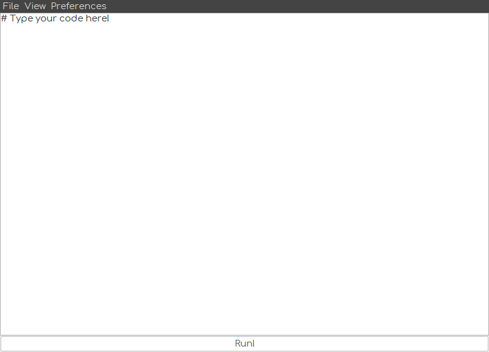
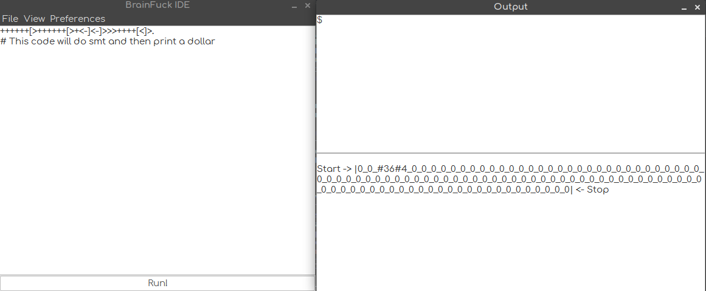
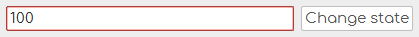

# BrainFuck-IDE
Small BrainFuck IDE with compiler.

## Purpose
Just to fun with ```kotlinlang``` (wordplay, meh) and to help you with your beginnings in understanding the **best language in da world** - *BrainFuck*

## How to use?
At the start you'll see something like this:



What can you do next?

- You can write some code and then execute it
- You can Create, Open, Save source files
- You can see output of your program and state of array ("infinite" tape)
- You can change size of the tape if default 100 is not enough for your *innovational* algorithm




